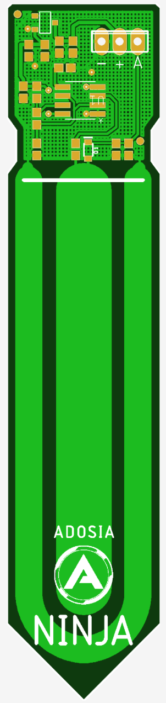

# Adosia NINJA Capacitive Analog Soil Moisture Sensor

Adosia NINJA Capacitive Analog Soil Moisture Sensor design is part of Adosia's open hardware IO platform initiative to enable anyone to easily create a variety of custom WiFi control systems using the **Adosia IoT Platform**.

The Adosia NINJA sensor is designed to be pin compatible with the popular open hardware including **Arduino**, **ESP8266**, **Raspberry Pi** and other popular microcontroller boards.

# Adosia NINJA Features:

- corrosion resistant by design

- capacitive sense technology for longer field life

- input voltage: 3.3 ~ 5.0 VDC

- output voltage: 0 ~ 3.0 VDC

- footprint open for custom header pin / connector

- dimension: 98mm * 22mm (3.86in x 0.866in)

# Applications:

- automate watering for gardening / hydroponics / aquaponics

- self-watering pots and planters

- personal cultivation setups and feeder control systems

- moisture level monitoring

- nursery and tree care

- IoT data applications

Navigate the hardware subdirectory to find the schematics and layout file that can be used to manufacture this board

#[Buy Adosia IoT Hardware](https://adosia.io)

*NINJA was inspired by the open hardware capacitive soil moisture sensor by DFRobot