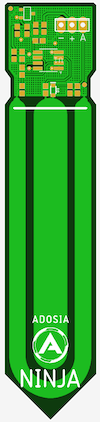

# Adosia NINJA Capacitive Analog Soil Moisture Sensor - [Buy Adosia IoT Hardware](https://adosia.io)

Adosia NINJA Capacitive Analog Soil Moisture Sensor design is part of Adosia's open hardware IO platform initiative to enable anyone to easily create a variety of custom WiFi control systems using the **Adosia IoT Platform**.

The Adosia NINJA sensor is designed to be pin compatible with the popular open hardware **Arduino**, **ESP8266**, **Raspberry Pi** and other popular controller boards.

# Adosia NINJA Capacitive Analog Soil Moisture Sensor

# Adosia NINJA Features:

- Capacitive Sense Technology for longer field life

- 5V - 3.3V input

- 3.0V output

- footprint open for custom header pin / connector

# Applications:

- gardening / hydroponics / aquaponics

- personal cultivation feeder control systems

- refill water reservoir on detecting low water

Navigate the hardware subdirectory to find the schematics and layout file that can be used to manufacture this board

*NINJA was inspired by the open hardware capacitive soil moisture sensor by DFRobot