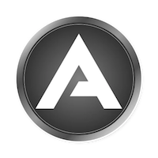
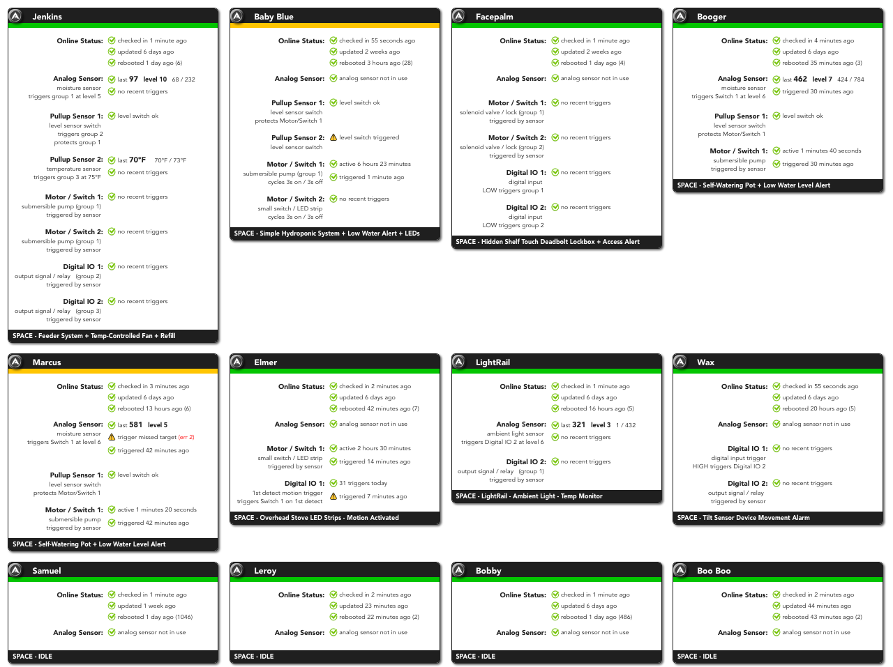
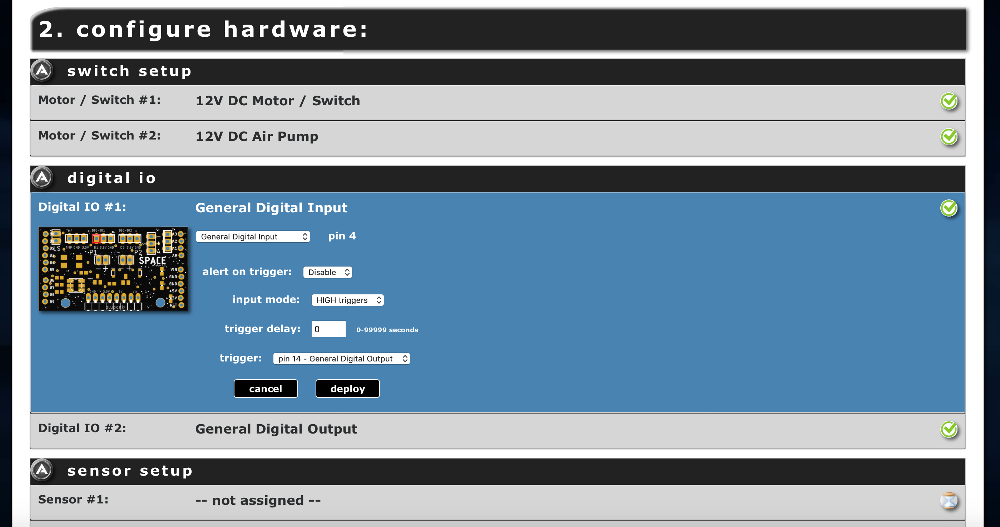
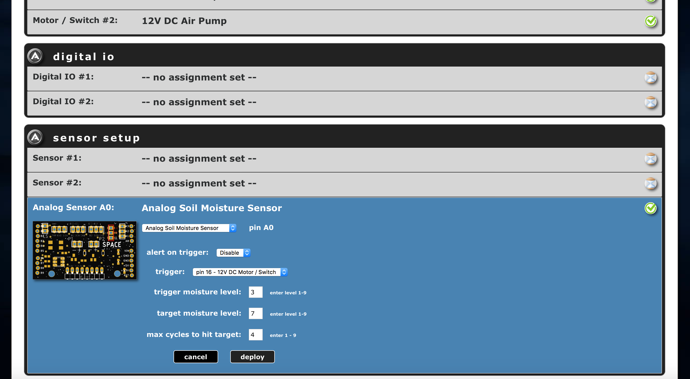

# The Adosia IoT Platform - [adosia.com](https://adosia.com)

The **Adosia IoT Platform** is a free cloud based tool paired with an open hardware initiative that enables anyone to create, customize, deploy and manage custom WiFi control systems using supported open IoT WiFi hardware.

The next phase of development for the Adosia IoT Platform will leverage cryptocurrency to enable Adosia users with a peer-to-peer marketplace to sell/license their IoT creations to other Adosia users.

**Learn More About the Adosia IoT Platform - see [Adosia Learn Page](https://adosia.com/faq.php)**

# Dashboard View - Connected IoT Devices

# How to Connect IoT Hardware to the Adosia IoT Platform

**1. Sign Up FREE for the [Adosia IoT Platform](https://adosia.com)**

**2. Obtain compatible IoT hardware pre-flashed with the latest Adosia binary by either:**

  - purchasing a WEMOS WiFi baseboard pre-flashed with the Adosia binary (along with optional [Adosia SPACE IO board](https://adosia.io/product/adosia-iot-space-io-board-shield/)) from the [Adosia IoT Store](https://adosia.io)
 
  - or you can use the popular Arduino IDE to download by latest Adosia binary by flashing your own WEMOS WiFi baseboard with Adosia's open source [phoenix connect script](https://github.com/adosia/adosia-iot/tree/master/adosia_phoenix)

**3. Use a mobile device to connect your IoT hardware to the Adosia IoT Platform (see [Adosia Learn Page](https://adosia.com/faq.php))**
  

Compatible open hardware boards flashed using Adosia's open source [phoenix connect script](https://github.com/adosia/adosia-iot/tree/master/adosia_phoenix) and the Arduino IDE will automatically connect to Adosia servers to download the latest Adosia binary.

The schematics and layout files for Adosia's open hardware SPACE v2.2 IO board (compatible with WEMOS D1 R2 WiFi baseboard) can be found [here](https://github.com/adosia/adosia-iot/tree/master/SPACE_v2.2/hardware/IO_BOARD_WEMOS_D1R2)

Adosia will publish manufacturing schematics and layout files for an IO board compatible with the WEMOS D1 Mini baseboard in the near future.

# Setting Up an IoT Device Profile

# ADO Token Allocations for Early Adosia IoT Platform Adopters

Prior to the future release of the ADO smart contract on the Cardano blockchain, a random amount of ADO tokens will be tentatively allocated to a respective
Adosia IoT Platform user's account whenever that user first connects (and activates) any Adosia-supported open hardware IoT device to the Adosia IoT Platform.

Once the Adosia platform confirms newly connected IoT hardware to be a legitimate IoT device (ruling out bot connections, platform manipulation, etc.),
the respective tentative token allocation will be secured to the connecting user's account with the Adosia IoT Platform. All token allocations secured prior to the production release
of the ADO smart contract (following Cardano smart contract availability) will become transferable to the respective user's Cardano wallet address upon the release of the ADO smart contract.

The Adosia IoT Platform supports ESP8266-based WiFi baseboards which currently include the WEMOS D1 R2 and WEMOS D1 Mini WiFi baseboards,
and does not require users to purchase hardware from (or manufactured by) Adosia.  This enables anyone in the world the ability to begin using and creating with the Adosia IoT Platform for free.

