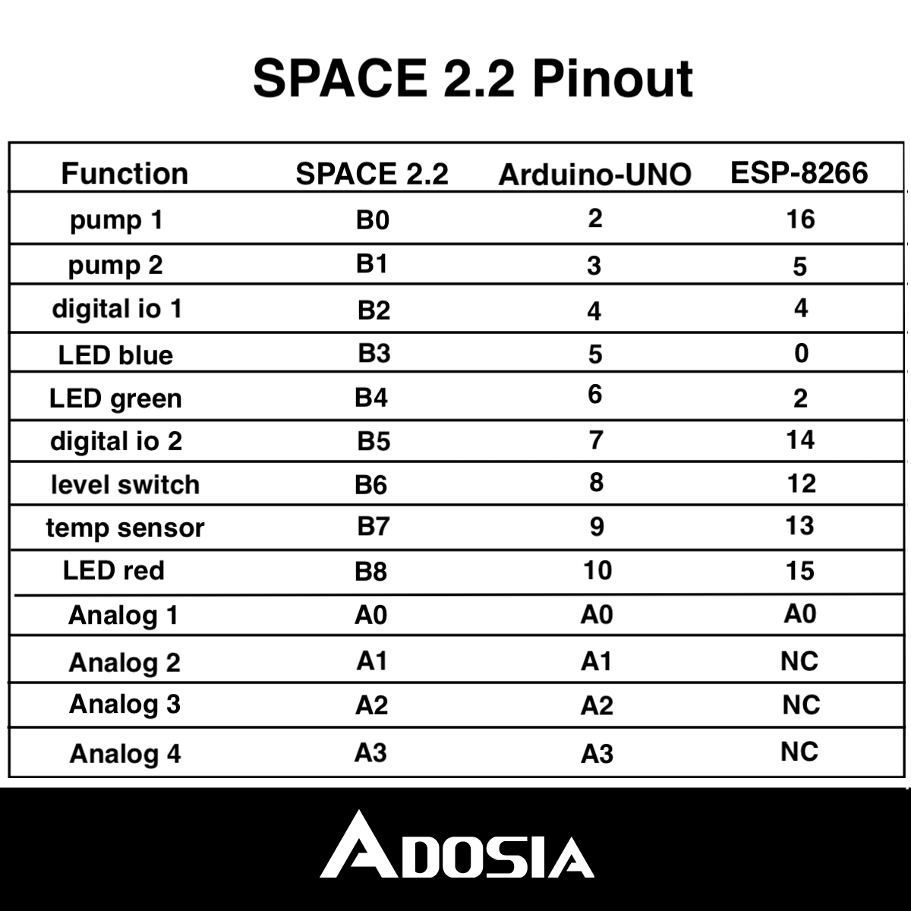

# Adosia SPACE IO Shield v2.2 - [Buy Adosia IoT Hardware](https://adosia.io)

Adosia SPACE v2.2 is part of Adosia's open hardware IO platform initiative to enable anyone to easily create a variety of custom WiFi control systems using the Adosia IoT Platform.

The SPACE v2.2 IO shield is designed to be pin compatible with the popular open hardware Arduino Uno R3 and WEMOS D1R2 WiFi controller boards.

The default open source software to connect your ESP8266-based SPACE v2.2 IO hardware (compatible with WEMOS D1R2 or WEMOS D1 Mini) to the Adosia IoT Platform and download the latest Adosia binary can be found [here](https://github.com/adosia/adosia-token/tree/master/hardware/bluponix/space_v2.2/sample_code/).

# SPACE v2.2 for WEMOS D1R2 (WEMOS D1 Mini coming soon)

# Adosia SPACE v2.2 IO Board Features (WEMOS D2R2):

- x2 diode-protected transistor switch channels to safely drive pumps or solenoids

- x2 digital IO pins tied to onboard 4.7kΩ pullups (water level sensor switch or temperature sensor)

- x2 digital IO pins (relays, motion detectors, push buttons, tilt sensors, vibration sensors, etc)

- x1 analog port

- bright onboard RGB LED

- breakout voltage supply headers providing 2x GND, 2x 3.3v, 2x 5v and 2x Vin

# Applications:

- custom WiFi control systems / home automation

- gardening / hydroponics / aquaponics

- motion detect applications

- personal cultivation feeder control systems

- refill water reservoir on detecting low water

- tamper alarms

- digital lock applications

- temperature sensor triggered fan control

- lighting / appliance power control

- wide array of WiFi / IoT / relay applications

*WEMOS D2R2 recommended supply voltage Vin = 12V

*transistor/diode switch channels can drive up to 450mA at supply voltage Vin

*relays trigger on programmatic LOW

Navigate the hardware subdirectory to find the schematics and layout file that can be used to manufacture this board