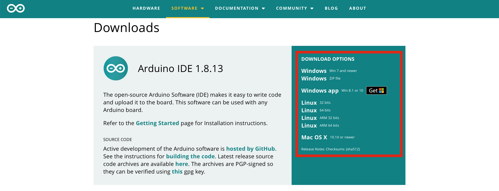
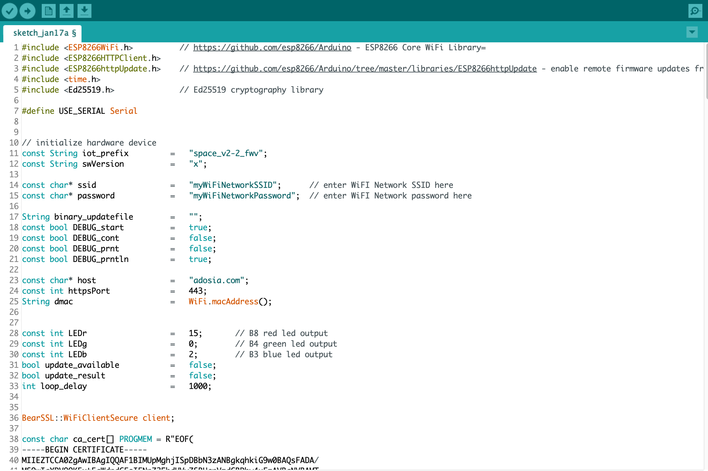
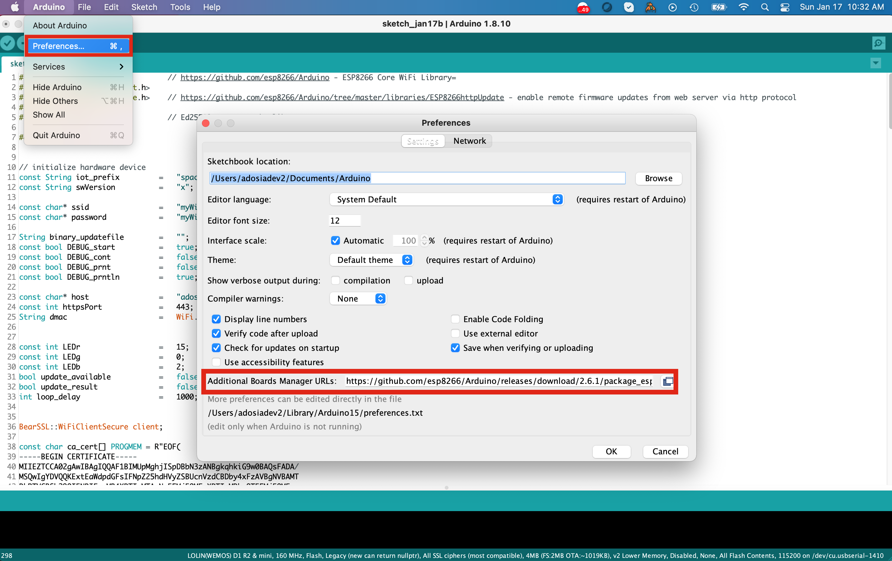
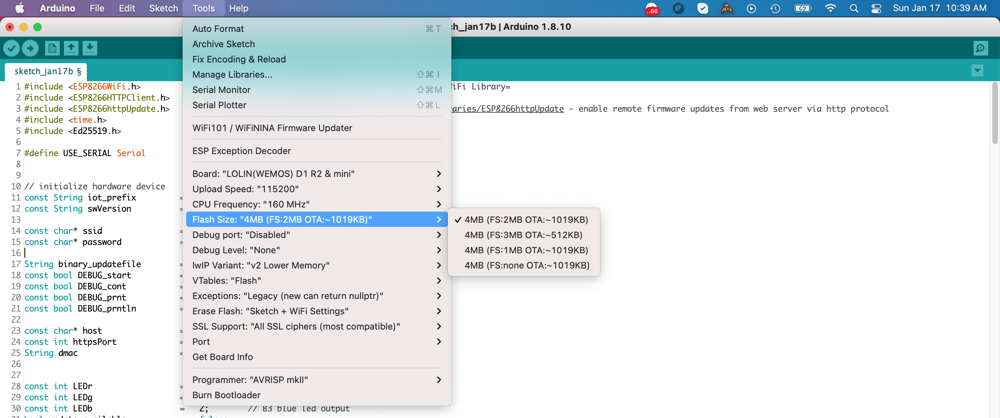
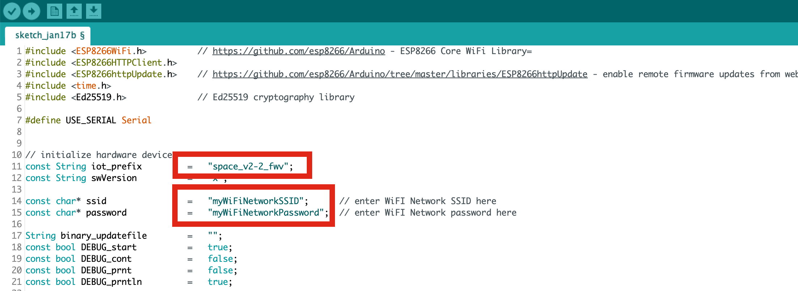

# Adosia Phoenix Connect Script for SPACE IO Boards

Flash the [adosia_phoenix.ino Phoenix Connect script](https://github.com/adosia/adosia-iot/blob/master/adosia_phoenix/adosia_phoenix.ino) to your ESP8266-based **WEMOS D1 R2** or **WEMOS D1 Mini** WiFi baseboards to automatically download the latest Adosia binary to ready your own WiFi hardware for connecting to the Adosia IoT Platform.

You can also use the [Phoenix Connect script](https://github.com/adosia/adosia-iot/blob/master/adosia_phoenix/adosia_phoenix.ino) to reconnect an existing previously connected device which now may be unable to connect.

Alternatively, you can purchase IoT hardware pre-flashed with the Adosia binary from the [Adosia IoT Store](https://adosia.io).

Please support the Adosia IoT open hardware initiative by sending any amount of Ada to the following Cardano address:
**addr1qx0w683ua2hua30jhan3xfn5f473pjgh4vgxpx7mnuwfxddyah4yv7wh5dktyxs4cf7gf72pqa39twrp3qs56v0e6y4qupjq4t**

# Steps to Download the Latest Adosia Binary

1. Download the Arduino IDE software appropriate for your operating system if you have not already done so. Simply visit the **[Arduino website](https://www.arduino.cc/en/software)**:

2. Open the Arduino IDE and open a new sketch (select **File > New**) if needed. Next copy and paste the raw **[adosia_phoenix.ino](https://raw.githubusercontent.com/adosia/adosia-iot/master/adosia_phoenix/adosia_phoenix.ino) sketch** into your **Arduino IDE**

3. Prepare the Arduino IDE - under **Arduino > Preferences** set the Additional Boards Manager URLs to: **https://github.com/esp8266/Arduino/releases/download/2.6.1/package_esp8266com_index.json**

4. Under **Tools**, set your IDE settings to the following:
	- **Board:** *LOLIN(WEMOS) D1 R2 & mini*
	- **Flash Size:** *4MB (FS:2MB OTA:!~019KB)*
	- **Upload Speed:** *115200 baud*
	- **Erase Flash:** *Sketch + WiFi Settings*
	- **SSL Support:** *All SSL ciphers (most compatible)*
	- **Port:** */dev/cu.usbserial...*
	

5. Update **lines 14 and 15** respectively with the **Network SSID** and **Password** for *your WiFi Network* (*WiFi login credentials are never transmitted to Adosia servers*), and make sure **line 11** has the correct **iot_prefix** for the IO board you are using (default is **space_v2-2_fwv**)

6. Use the Arduino IDE to upload the sketch to your IoT WiFi hardware
	- in extreme scenarios you may need to set **Erase Flash** to *All Flash Contents* - this will create a new device key if one already exists

7. When the upload completes, your board should automatically reset. If the board does not reset manually reset your board (recycle power) to force the OTA update process to begin downloading the latest binary from Adosia servers

8. Now you can proceed to connect your device to the Adosia IoT platform as show in this video:

If using an Adosia SPACE IO board v2.3, the onboard LED will blink green 10 times once the baseboard successfully connects to your WiFi network, and will blink blue 6 times once the latest Adosia binary has been successfully downloaded.  The board should now be ready to connect to the Adosia IoT Platform just as if you purchased it from the [Adosia IoT Store](https://adosia.io)

***if the Arduino IDE doesn't recognize your board, you may need to [download the CH340 driver](https://learn.sparkfun.com/tutorials/how-to-install-ch340-drivers/all)***

# iot_prefix value to set based on Adosia IO Board

 - SPACE (or no IO board) => update iot_prefix on line 11 to **space_v2-2_fwv**
